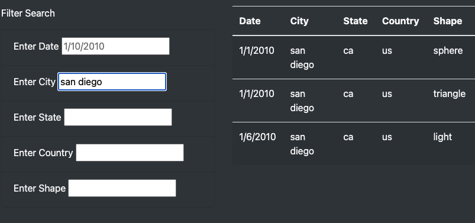
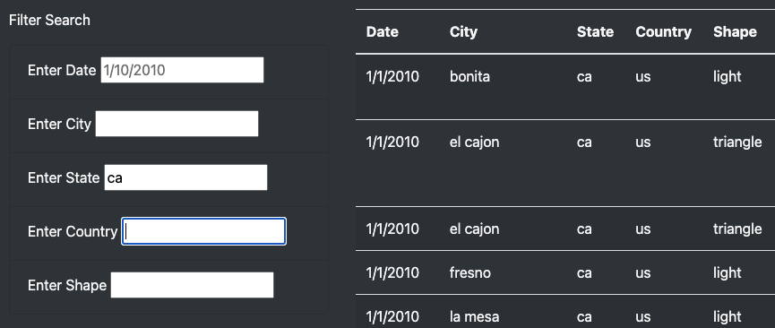
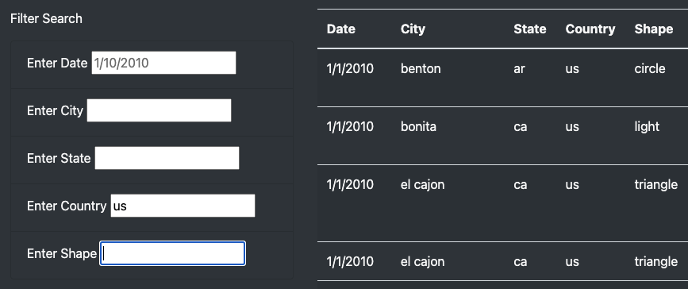
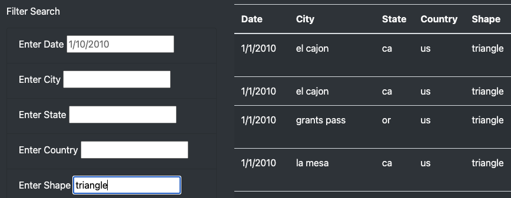

# UFO Sightings with JavaScript

## Overview of Project

Client wants more in-depth analysis by allowing users to filter for:

- Multiple criteria at the same time
- Date
- City
- State
- Country
- Shape

## Results
Describe how someone might use the new webpage by walking through the process of using the search criteria.

Filter by date was already functional in previous version of webpage.
-----

Filter by City
-----

Filter by State
-----

Filter by Country
-----

Filter by Shape
-----

## Summary

- Describe one drawback of this new design and two recommendations for further development:

- The primary drawback I see with this design is that the data entered into the filter boxes are case sensitive. If the user uses a different case when entering data for city or state, for example, there is no filtered data returned in the table.

Improvements to the design:
- allow for alternative cases when searching for text.
- allow for real-time searching as the user is entering the text. The table can be filtering with each letter as it is typed.
